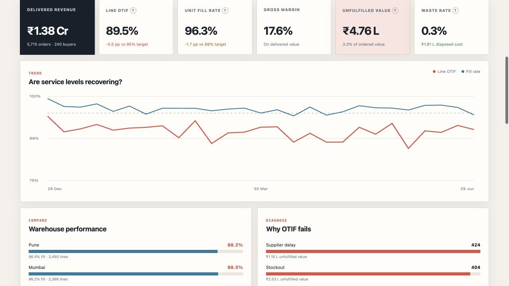
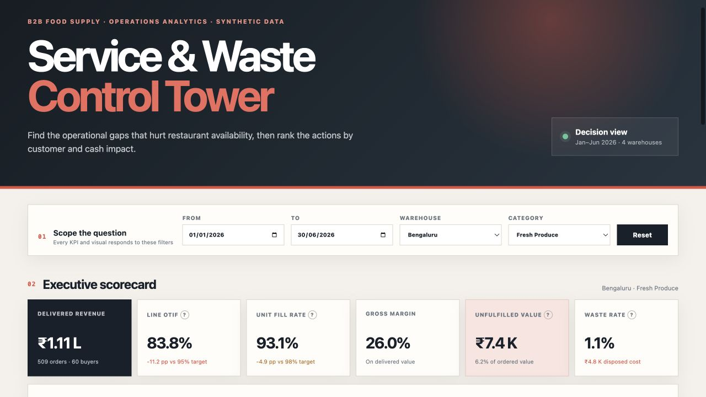
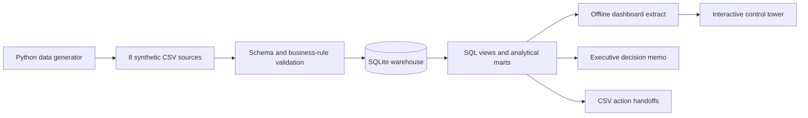

# Service & Waste Control Tower

> A local-first operations analytics product for B2B food-supply teams. Monitor fulfilment, diagnose service failures, quantify inventory loss, and turn warehouse-level problems into a ranked action plan.


[Dashboard](docs/index.html) · [Decision memo](reports/executive_summary.md) · [Architecture](docs/architecture.md) · [Data dictionary](docs/data_dictionary.md) · [Troubleshooting](docs/troubleshooting.md) · [Contributing](CONTRIBUTING.md) · [Security](SECURITY.md)


## What this project is

The Service & Waste Control Tower is an end-to-end decision-support product for fulfilment, procurement, warehouse, quality, and category teams. It answers one operational question:

> **Where are service failures and inventory losses concentrated, what is their financial impact, and what should the team investigate first?**

It is more than a dashboard mock-up. The repository contains the complete analytical workflow: deterministic source-data generation, schema and business-rule validation, a relational SQLite warehouse, SQL marts, an interactive browser dashboard, CSV handoffs, an executive decision memo, and automated tests.

The included demo models six months of B2B food-supply operations:

| Warehouses | Categories | SKUs | Buyers | Orders | Order lines | Inbound receipts |
|---:|---:|---:|---:|---:|---:|---:|
| 4 | 8 | 32 | 240 | 5,715 | 13,855 | 3,225 |

> **Data boundary:** every business record is deterministic synthetic data generated inside this repository. The project is not affiliated with or representative of any real company and contains no private, scraped, customer, employee, or production data.

## What it does

| Capability | What the product provides |
|---|---|
| Monitor service health | Tracks delivered revenue, line OTIF, unit fill rate, gross margin, unfulfilled value, and waste rate |
| Slice the operation | Filters every KPI, chart, insight, and table by date, warehouse, and product category |
| Diagnose failures | Compares weekly trends, warehouse performance, failure reasons, stockouts, delays, quality rejections, and cold-chain exceptions |
| Prioritise work | Ranks warehouse × category gaps using service performance, unfulfilled value, and waste cost |
| Review suppliers | Scores inbound reliability using on-time receipts, acceptance fill, and rejected cost |
| Support decisions | Generates plain-language insights, recommended next actions, a decision memo, and CSV handoffs |
| Reproduce results | Rebuilds the same dataset and outputs from seed `42`, with no third-party Python packages or network calls |

The current synthetic network surfaces three deliberate incident patterns—Bengaluru Fresh Produce, Mumbai Frozen Foods, and Pune Dairy—while also showing why the worst percentage gap is not always the largest financial opportunity.

## Product tour

### 1. Executive control-tower view

The overview shown above starts with the health of the network: revenue fulfilled, OTIF, fill rate, margin, unfulfilled demand, and waste. All six KPIs respond to the selected operating scope.

### 2. Operational diagnostics

Use the weekly service trend to separate isolated incidents from persistent gaps, compare warehouses, and see which failure modes account for the most affected lines and value.



### 3. Warehouse × category drill-down

Narrow the same decision view to a specific operating cell. This example exposes the Bengaluru × Fresh Produce incident: 83.8% line OTIF, 93.1% fill rate, and a waste rate above the illustrative guardrail.



Below the charts, the dashboard continues into an auto-generated analyst readout, a prioritised action queue, and a supplier watchlist.

## Run locally

### Requirements

- Python 3.11 or newer
- GNU Make
- Any modern browser

There is no virtual environment to create, no package to install, no `.env` file to configure, and no database server to start. SQLite is accessed through Python's standard library.

### Fastest path: open the committed dashboard

From the repository root:

```bash
python3 -m http.server 8000 --directory docs
```

Open [http://localhost:8000](http://localhost:8000) in a browser. Stop the server with `Ctrl+C`.

The dashboard is fully static and can also be opened directly from `docs/index.html`. A local HTTP server is recommended because it matches normal browser behaviour.

### Rebuild everything from source

```bash
make setup
make test
python3 -m http.server 8000 --directory docs
```

`make setup` regenerates the synthetic CSV inputs, validates and rebuilds the SQLite warehouse, exports the dashboard dataset, and refreshes the reporting outputs. On success, the build reports:

```text
Generated 23,259 deterministic synthetic rows across 8 CSV files.
Validated and loaded 23,259 rows into control_tower.db.
Exported dashboard data: order_lines=13,855, receipts=3,225, waste_groups=172.
Exported executive memo, KPI snapshot, action queue, and supplier scorecard.
```

### Useful commands

| Command | Purpose |
|---|---|
| `make setup` | Run the complete data → warehouse → dashboard → report build |
| `make data` | Regenerate all deterministic synthetic CSV inputs |
| `make warehouse` | Validate the inputs and atomically rebuild SQLite |
| `make dashboard` | Refresh `docs/data.js` for the browser dashboard |
| `make report` | Refresh the decision memo and CSV handoffs |
| `make test` | Run reproducibility, integrity, metric, incident, and output-safety tests |
| `make check` | Rebuild everything and run the entire test suite |
| `make clean` | Remove only explicitly listed artifacts that can be reproduced |

## Basic product workflow

An operations lead uses the dashboard in five steps:

1. **Set the scope** — choose a date range, warehouse, and category.
2. **Read the scorecard** — check OTIF and fill rate alongside revenue, margin, value at risk, and waste.
3. **Diagnose the gap** — inspect the weekly trend, warehouse comparison, and failure-reason breakdown.
4. **Prioritise the response** — use the action queue to rank service and cash-impact opportunities together.
5. **Assign the follow-up** — take the recommended next move and supplier watchlist into the weekly operating review.

The dashboard never silently claims causation. Its recommendations are transparent rules designed to identify where a human investigation should begin.

## How the pipeline works



1. `src/generate_data.py` creates a reproducible six-month operating dataset and records the row counts and data boundary in `data/raw/manifest.json`.
2. `src/build_warehouse.py` validates file schemas, types, relationships, business rules, and foreign keys before atomically replacing the SQLite database.
3. `sql/02_marts.sql` creates reusable order-line, daily-operations, supplier-performance, waste, and action-queue views.
4. `src/export_dashboard.py` exports a compact JavaScript data payload so the dashboard works without an API or external library.
5. `src/export_report.py` produces the executive memo, KPI snapshot, ranked action queue, and supplier scorecard.

## Metrics in the product

| Metric | Definition | Decision supported |
|---|---|---|
| Line OTIF | Lines delivered on or before promise date **and** fulfilled in full ÷ all lines | Is the customer promise being met? |
| Unit fill rate | Fulfilled units ÷ ordered units | Is inventory available? |
| Delivered revenue | Fulfilled quantity × selling price | How much demand was fulfilled? |
| Unfulfilled value | Ordered value − delivered value | Where is the demand-loss proxy concentrated? |
| Gross margin | Gross profit ÷ delivered revenue | Can a recovery action remain margin-aware? |
| Waste rate | Disposed units ÷ accepted inbound units | Where is inventory loss disproportionate? |
| Supplier on-time | Receipts received by expected date ÷ all receipts | Is inbound delivery reliable? |
| Acceptance fill | Accepted units ÷ ordered procurement units | Is the supplier complete and quality-compliant? |

The 95% OTIF, 98% fill-rate, and 1% waste thresholds are illustrative operating benchmarks, not claimed targets for any real company. See the [metric dictionary](docs/data_dictionary.md) for table grains and formal definitions.

## Technology stack

| Layer | Technology | Responsibility |
|---|---|---|
| Data generation | Python 3.11+ standard library | Deterministic operational records and a machine-readable manifest |
| Data quality | Python + SQLite constraints | CSV contracts, value checks, relationships, foreign keys, and atomic builds |
| Analytical warehouse | SQLite | Portable relational storage with no service dependency |
| Transformation | SQL | Joins, CTEs, views, aggregations, window functions, KPI contracts, and ranked marts |
| Product UI | HTML5, CSS3, Vanilla JavaScript, SVG | Responsive filters, scorecards, charts, insights, and decision tables |
| Reporting | Python + SQL | Markdown decision memo and operational CSV exports |
| Testing | `unittest` | Reproducibility, integrity, metrics, planted incidents, and published-output safety |
| Automation | GNU Make + GitHub Actions | One-command local workflow and read-only CI verification |

## Project structure

```text
.
├── data/raw/                  # Generated CSV inputs and committed manifest
├── docs/                      # Dashboard, architecture, dictionary, troubleshooting, screenshots
├── reports/                   # Decision memo, KPI snapshot, and CSV action handoffs
├── sql/                       # Schema, analytical marts, and example analysis queries
├── src/                       # Generation, validation, warehouse, and export modules
├── tests/                     # End-to-end standard-library test suite
├── warehouse/                 # Rebuildable local SQLite database
├── CONTRIBUTING.md            # Development workflow and change contracts
├── Makefile                   # Development and build commands
└── SECURITY.md                # Data, privacy, and runtime boundaries
```

Good entry points are [`docs/index.html`](docs/index.html) for the product, [`docs/architecture.md`](docs/architecture.md) for the system design, [`sql/03_analysis.sql`](sql/03_analysis.sql) for the analytical questions, and [`src/build_warehouse.py`](src/build_warehouse.py) for the data-quality workflow.

## Scope and limitations

### In scope

- A local, reproducible batch analytics workflow for six months of synthetic food-supply operations
- Service, availability, margin, inbound reliability, quality acceptance, and waste diagnostics
- Date, warehouse, and category exploration across four warehouses and eight categories
- Transparent rule-based prioritisation and decision-support outputs
- A dependency-free product demo that can be rebuilt and reviewed offline

### Not in scope

- **Real company performance:** planted incidents demonstrate analytical diagnosis; they do not estimate any real business's operations.
- **Production ingestion:** there are no ERP/WMS/TMS connectors, streaming events, scheduled refreshes, or incremental loads.
- **Multi-user application features:** there is no authentication, role-based access, server API, alerting, collaboration, or action write-back.
- **Causal or predictive modelling:** the product does not prove root cause, forecast demand, optimise inventory, or estimate future savings.
- **Line-level root-cause precision:** failure reasons are currently inherited from the order; a production implementation should capture reason codes at order-line or event level.
- **Forecasted value:** protected value is transparent scenario arithmetic—30% of unfulfilled value plus 20% of waste cost—not a financial forecast.
- **Large-scale browser serving:** the demo ships its analytical extract to the browser; a production-scale version should serve pre-aggregated data through a governed API or BI layer.

Recommended actions should be validated with procurement, warehouse, quality, inventory, and category owners before execution.

## Testing and reproducibility

```bash
make check
```

The test suite verifies that:

- the generated dataset is byte-for-byte deterministic;
- manifest counts match the rows loaded into SQLite;
- foreign keys and metric contracts remain valid;
- the planted service incidents remain analytically detectable;
- the dashboard and handoff artifacts are safe, present, and reproducible.

CI rebuilds the complete project with read-only repository permissions and fails if committed analytical outputs drift from a fresh build.

Licensed under the [MIT License](LICENSE).
