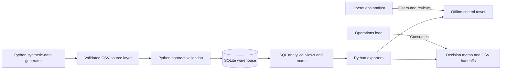
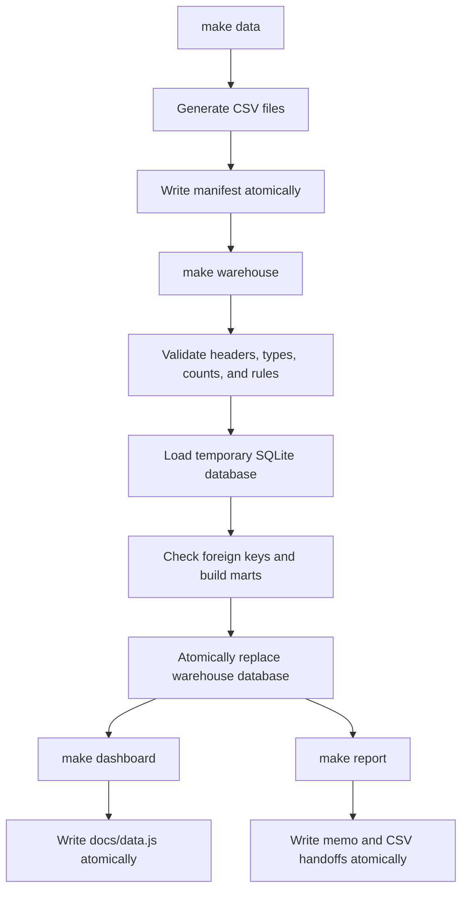
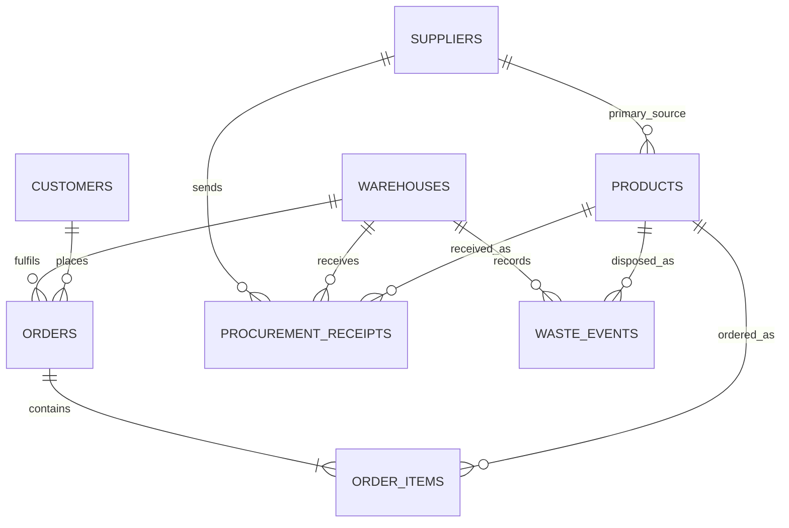

# Architecture

## System purpose

The Service & Waste Control Tower is a local, batch-oriented analytics product. It converts deterministic synthetic operating records into a validated relational warehouse, reusable SQL marts, an offline interactive dashboard, and decision-support exports.

The architecture optimises for auditability, portability, and a one-command rebuild—not production-scale ingestion or multi-user serving.

## System context



No component calls an external service. At runtime, the dashboard reads only its committed static HTML, CSS, JavaScript, SVG, and generated data payload.

## Component map

| Component | Location | Responsibility | Output |
|---|---|---|---|
| Configuration | `src/config.py` | Repository paths, observation period, and generator seed | Shared constants |
| Data generator | `src/generate_data.py` | Creates dimensions, orders, receipts, waste, planted incidents, and manifest | Eight CSV files + manifest |
| Schema | `sql/01_schema.sql` | Declares tables, keys, constraints, and indexes | Empty SQLite model |
| Warehouse builder | `src/build_warehouse.py` | Validates CSV contracts and business rules, loads data, builds marts atomically | SQLite database |
| Analytical marts | `sql/02_marts.sql` | Defines enriched order lines and reusable operational marts | Five SQLite views |
| Analyst queries | `sql/03_analysis.sql` | Demonstrates KPI, Pareto, trend, supplier, and priority analysis | Query examples |
| Dashboard exporter | `src/export_dashboard.py` | Creates a compact static extract for browser-side filtering | `docs/data.js` |
| Report exporter | `src/export_report.py` | Produces the memo and operational CSV handoffs | Files in `reports/` |
| Dashboard UI | `docs/index.html`, `docs/assets/` | Calculates filtered KPIs and renders the decision view | Interactive local product |
| Test suite | `tests/test_pipeline.py` | Verifies reproducibility, integrity, metrics, incidents, and outputs | Pass/fail evidence |
| Workflow | `Makefile` | Connects build, test, and cleanup stages | Repeatable developer commands |

## Build sequence

`make setup` executes this dependency graph:



Each output stage writes to a sibling temporary file first and replaces the published artifact only after the write or validation succeeds. A failed build should not leave a partially written database, dashboard payload, or report.

## Relational data model



The service path is analysed at order-line grain. The inbound path is analysed at receipt grain, and inventory loss is recorded at waste-event grain. Warehouse and product category are the shared dimensions used to compare these paths.

See the [data and metric dictionary](data_dictionary.md) for column-level contracts.

## Analytical layers

```text
Source tables
    ├── fulfilment: customers → orders → order_items ← products ← suppliers
    ├── inbound: procurement_receipts ← suppliers/products/warehouses
    └── loss: waste_events ← products/warehouses
            │
            ▼
v_order_line_enriched
            │
            ├── mart_daily_operations
            ├── mart_supplier_performance
            ├── mart_waste_daily
            └── mart_action_queue
                    │
                    ├── dashboard extract
                    ├── executive memo
                    ├── KPI snapshot
                    ├── action queue
                    └── supplier scorecard
```

### Why order-line OTIF

OTIF is evaluated per line rather than per order. This prevents a multi-line order with a partial fulfilment from appearing successful simply because it arrived on time. All lines on an order inherit its delivery date and order-level failure reason.

### Why separate service and inbound grains

Supplier receipts and customer orders do not have a causal key in this demonstration. They are compared through warehouse, category, and time. The dashboard therefore treats supplier performance as diagnostic context—not proof that a supplier caused a customer-facing failure.

### How prioritisation works

`mart_action_queue` ranks each warehouse × category cell using unfulfilled value, waste cost, and an OTIF-gap weight. The recommendation text is selected from the leading failure mode or waste guardrail. This is explainable business logic, not machine learning or optimisation.

## Runtime architecture

The dashboard has no backend:

1. `docs/index.html` loads `docs/data.js` into a browser global.
2. `docs/assets/app.js` maps the compact row arrays to objects.
3. Date, warehouse, and category filters are applied in memory.
4. KPIs, SVG charts, insights, recommendations, and tables are recalculated after each filter change.

This makes the product easy to run and review offline. It also establishes a practical scale boundary: a production implementation should move large or access-controlled datasets behind a governed API, warehouse, or BI semantic layer.

## Published artifacts

| Artifact | Contract | Rebuild command | Version-controlled |
|---|---|---|---|
| `data/raw/manifest.json` | Seed, date range, privacy flags, row counts | `make data` | Yes |
| `data/raw/*.csv` | Generated source records | `make data` | No |
| `warehouse/control_tower.db` | Validated SQLite model and marts | `make warehouse` | No |
| `docs/data.js` | Dashboard extract | `make dashboard` | Yes |
| `reports/executive_summary.md` | Generated decision memo | `make report` | Yes |
| `reports/kpi_snapshot.csv` | Metric/value/definition handoff | `make report` | Yes |
| `reports/action_queue.csv` | Ranked operational gaps | `make report` | Yes |
| `reports/supplier_scorecard.csv` | Supplier reliability handoff | `make report` | Yes |

CI runs `make check` and fails if rebuilding the committed manifest, dashboard payload, or reports creates a diff.

## Reliability and security properties

- Deterministic seed and explicit manifest make source generation reproducible.
- CSV headers and numeric conversions fail closed before load.
- SQLite `CHECK`, primary-key, and foreign-key constraints enforce relational rules.
- Cross-table business rules validate customer/warehouse cities, category alignment, success labels, and customer activation dates.
- The database is built at a temporary path and replaced only after validation.
- The dashboard has no third-party scripts, trackers, cookies, forms, credentials, or network requests.
- CI receives read-only repository contents permission.

See [`../SECURITY.md`](../SECURITY.md) for the threat boundary and disclosure process.

## Design decisions and trade-offs

| Decision | Benefit | Trade-off |
|---|---|---|
| Python standard library only | No install step or dependency supply chain | Fewer dataframe and charting conveniences |
| SQLite warehouse | Portable SQL and strong local constraints | Not designed for concurrent or distributed workloads |
| Static browser extract | Offline use and zero backend operations | Entire filtered dataset is loaded in browser memory |
| Vanilla JavaScript and SVG | No runtime CDN or framework dependency | More custom rendering code |
| Deterministic planted incidents | Stable tests and meaningful analytical findings | Results do not estimate real-world incident prevalence |
| Rule-based recommendations | Explainable and auditable | Requires human validation and cannot establish causality |

## Extension points

### Add a source field

Update the generator, loader contract, SQLite schema, affected marts/exporters, data dictionary, and tests in one change. The ordered checklist is in [`../CONTRIBUTING.md`](../CONTRIBUTING.md).

### Add a metric

Define its grain, numerator, denominator, date attribution, filters, null behavior, and unit before implementing it. Keep the SQL, dashboard, exports, and documentation aligned.

### Replace synthetic sources

Introduce an ingestion boundary that emits the documented CSV or table contracts. Do not remove validation when replacing the generator. Production sources also require access control, secrets management, lineage, retention, and privacy review that are intentionally outside this repository's current scope.

### Scale the dashboard

Retain the metric contracts and marts, but replace `docs/data.js` with pre-aggregated queries behind a governed API or BI semantic layer. Add authentication, authorization, observability, caching, and incremental refresh as separate production concerns.

## Related documentation

- [Product overview and local setup](../README.md)
- [Data and metric dictionary](data_dictionary.md)
- [Troubleshooting](troubleshooting.md)
- [Contributing guide](../CONTRIBUTING.md)
- [Security policy](../SECURITY.md)
